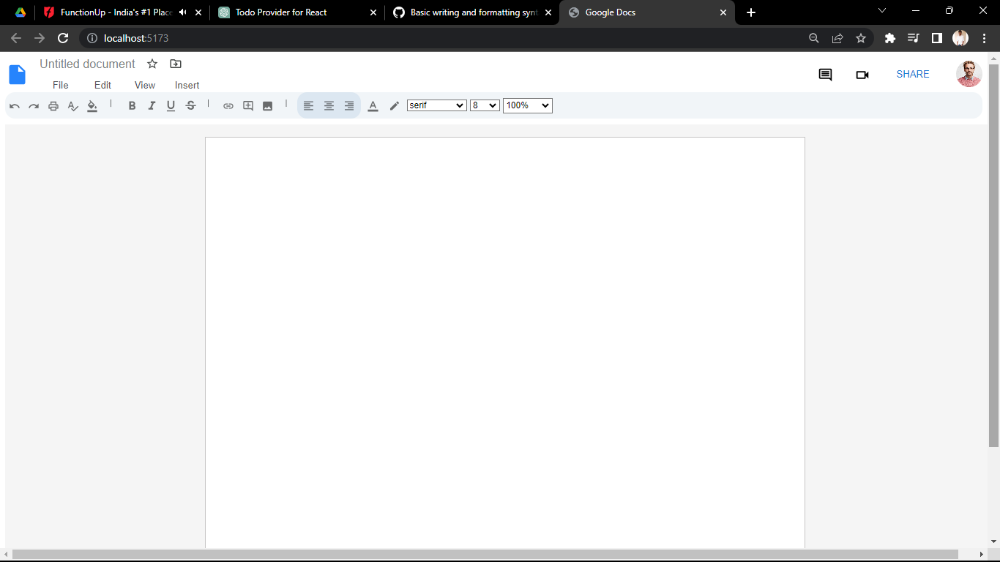

# Google Docs Clone

This is a Google Docs CLone, where user can format the text based on requirements and all basic text formatting is available  

## UI of Google Docs

## Deployment:
This project is deployed on open platform [vercel.com](https://vercel.com/) 

## Libraries

The following libraries are used in this project:

1. State Management: Recoil
2. UI Library: Material UI

## Collborators

1. Shivaram Dusa
2. Sandesh Ghadage
3. Shubham Kumar Jaiswal

## Project Link

You can access this project at https://docs-clone-ruddy.vercel.app/